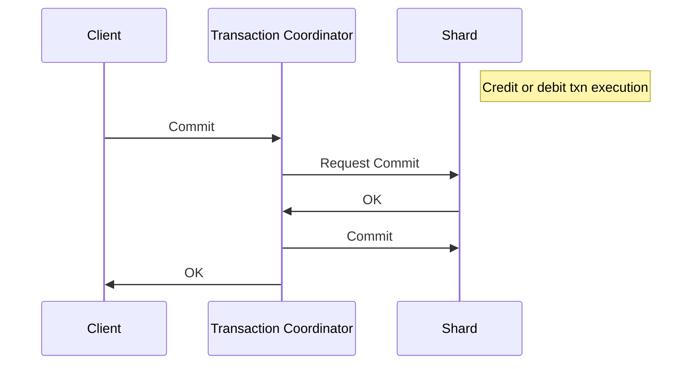

# Trabalho prático da matéria de Computação Distribuída

## Descrição e requisitos

Implemente em uma linguagem de programação (Java, Python, C++, ... do seu domínio) os códigos para:  
`Client`, `Transaction Coordenator` e `Shard` (originalmente `Shard A` e `Shard B`, responsáveis respectivamente por crédito e débito), utilizando a tecnologia de filas da figura abaixo.

- `Client` solicita uma função `OpClient()` com os parametros: data da operação, conta do cliente, tipo da operação ("C" para crédito ou "D" para débito) e valor da operação
- `Transaction Coordinator` solicita ao servidor de banco de dados `Shard A` a função `Credito()` com os parametros: data da operação, conta do cliente e valor da operação
- `Transaction Coordinator` solicita ao servidor de banco de dados `Shard B` a função `Debito()` com os parametros: data da operação, conta do cliente e valor da operação

